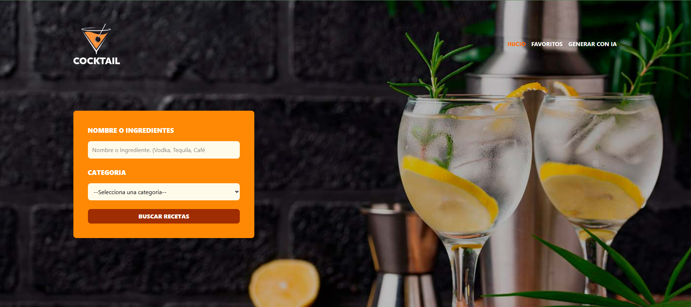

# 🥤 Buscador de Bebidas con React, TypeScript, Zustand, TailwindCSS y OpenRouter AI

[](https://app.netlify.com/projects/buscador-bebidas-ia/deploys)

Este proyecto es una aplicación web que permite a los usuarios **buscar bebidas**, **consultar recetas para prepararlas**, **marcar favoritas** y, además, **generar nuevas recetas con inteligencia artificial** usando un modelo de lenguaje.

Se trabajó con **React y TypeScript**, haciendo uso de herramientas modernas como Zustand para el manejo de estado global, Axios para las peticiones HTTP, React Router para navegación entre vistas, y TailwindCSS para un diseño responsivo y moderno. Además, se integró una API de IA vía OpenRouter para ofrecer funcionalidad avanzada con generación de recetas personalizadas a partir de prompts.

🔗 **Demo en producción**: [https://buscador-bebidas-ia.netlify.app/](https://buscador-bebidas-ia.netlify.app/)



---

## 🚀 Tecnologías utilizadas

- [React](https://react.dev/)
- [TypeScript](https://www.typescriptlang.org/)
- [Vite](https://vitejs.dev/)
- [Zustand](https://zustand-demo.pmnd.rs/)
- [TailwindCSS](https://tailwindcss.com/)
- [Zod](https://zod.dev/)
- [Axios](https://axios-http.com/)
- [React Router](https://reactrouter.com/)
- [OpenRouter AI SDK](https://github.com/openrouter-ai/openrouter-js)
- [Headless UI](https://headlessui.com/)

---

## 🧠 ¿Qué aprendí con este proyecto?

- Manejo avanzado del estado global con Zustand.
- Validación segura de datos con Zod.
- Separación eficiente de lógica de negocio y presentación.
- Gestión de favoritos con persistencia en `localStorage`.
- Uso de variables de entorno para proteger claves API.
- Implementación de modales accesibles con Headless UI.
- Integración con servicios de IA para generación dinámica de contenido.
- Optimización de UX con notificaciones contextuales y navegación fluida.

---

## 📦 Instalación

1. Clona el repositorio:

   ```bash
   git clone https://github.com/tu-usuario/bebidas-react-typescript.git
   cd bebidas-react-typescript
2. Instala las dependencias:
   ```bash
   npm install
3. Crea un archivo .env en la raíz del proyecto y agrega tu clave de OpenRouter:
   ```bash
     VITE_OPENROUTER_KEY=tu_clave_openrouter
    ```
4. Inicia el servidor de desarrollo:
   ```bash
     npm run dev
    ```
5. Abre tu navegador y accede a:
   ```bash
     http://localhost:5173
    ```

## 📁 Estructura del proyecto
```
src/
  components/      # Componentes reutilizables (DrinkCard, Header, Modal, Notification)
  layouts/         # Diseño principal de la aplicación
  lib/             # Configuración de la API de OpenRouter
  services/        # Lógica para consultas a APIs externas
  stores/          # Estado global con Zustand
  types/           # Tipos y esquemas definidos con Zod
  utils/           # Funciones utilitarias y validaciones
  views/           # Vistas principales (Inicio, Favoritos, Generador con IA)
```

## 🔍 Funcionalidades
  - 🔎 Buscar recetas por nombre o categoría.
  
  - 📋 Ver detalles de cada bebida en un modal elegante.
  
  - 💖 Agregar o eliminar bebidas de una lista de favoritos persistente.
  
 - 🤖 Generar recetas nuevas con IA a partir de un prompt.
  
 - 🔔 Notificaciones para acciones como agregar a favoritos o errores en la API.
  
 - 🌐 Navegación entre páginas con React Router.

🧾 Créditos
- [TheCocktailDB](https://www.thecocktaildb.com) – API para los cocteles y bebidas.

- [OpenRouter](https://openrouter.ai) – API para la generación de la receta usando IA.

---------------------
# 🥤 Cocktail Finder with React, TypeScript, Zustand, TailwindCSS, and OpenRouter AI

This is a web application that allows users to **search for cocktails**, **view recipes**, **mark drinks as favorites**, and even **generate new recipes using AI** powered by a language model via OpenRouter.

Built with **React and TypeScript**, the project leverages modern tools like Zustand for global state management, Axios for HTTP requests, React Router for page navigation, and TailwindCSS for styling. It also integrates an AI API to dynamically generate new cocktail recipes based on user prompts.

🔗 **Live Demo**: [https://buscador-bebidas-ia.netlify.app/](https://buscador-bebidas-ia.netlify.app/)


---

## 🚀 Technologies Used

- [React](https://react.dev/)
- [TypeScript](https://www.typescriptlang.org/)
- [Vite](https://vitejs.dev/)
- [Zustand](https://zustand-demo.pmnd.rs/)
- [TailwindCSS](https://tailwindcss.com/)
- [Zod](https://zod.dev/)
- [Axios](https://axios-http.com/)
- [React Router](https://reactrouter.com/)
- [OpenRouter AI SDK](https://github.com/openrouter-ai/openrouter-js)
- [Headless UI](https://headlessui.com/)

---

## 🧠 What I Learned

- Advanced state management using Zustand.
- Safe data validation with Zod.
- Clean architecture by separating business logic and presentation.
- Persisting favorites using `localStorage`.
- Securing API keys with environment variables.
- Building accessible modal dialogs with Headless UI.
- Integrating with AI services for dynamic recipe generation.
- Enhancing user experience with notifications and smooth navigation.

---

## 📦 Installation

1. Clone the repository:

   ```bash
   git clone https://github.com/your-username/bebidas-react-typescript.git
   cd bebidas-react-typescript
2. Install dependencies:
   ```bash
   npm install
3. Create a .env file at the root of the project and add your OpenRouter key:
   ```bash
     VITE_OPENROUTER_KEY=your_openrouter_key
    ```
4. Start the development server:
   ```bash
     npm run dev
    ```
5. Open your browser
   ```bash
     http://localhost:5173
    ```

## 📁 Project Structure
```
src/
  components/      # Reusable components (DrinkCard, Header, Modal, Notification)
  layouts/         # Main layout of the application
  lib/             # OpenRouter API configuration
  services/        # Logic for external API requests
  stores/          # Global state with Zustand
  types/           # Types and schemas defined with Zod
  utils/           # Utility functions and validators
  views/           # Main views (Home, Favorites, AI Generator)
```

  ##🔍 Features
  -🔎 Search for drinks by name or category.
  
  -📋 View recipe details in an accessible modal.
  
  -💖 Add or remove drinks from a persistent favorites list.
  
  -🤖 Generate new recipes with AI from user input.
  
  -🔔 User-friendly notifications for actions and errors.
  
  -🌐 Navigate across multiple pages with React Router.

🧾 Credits
- [TheCocktailDB](https://www.thecocktaildb.com) – Cocktail and drinks data API.

- [OpenRouter](https://openrouter.ai) – Recipe generation using AI.
